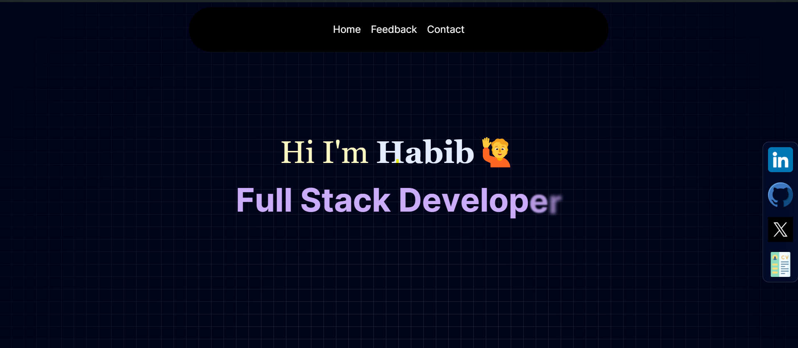
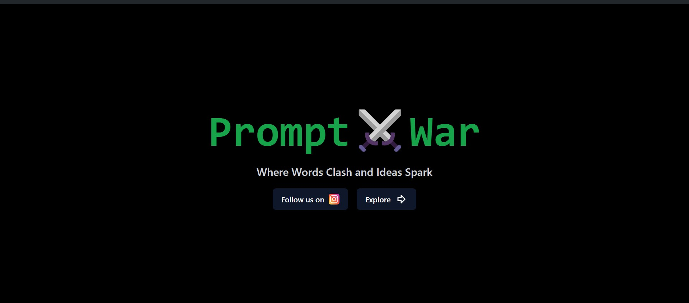
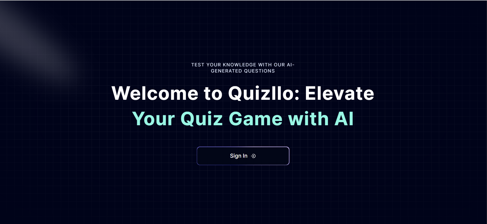
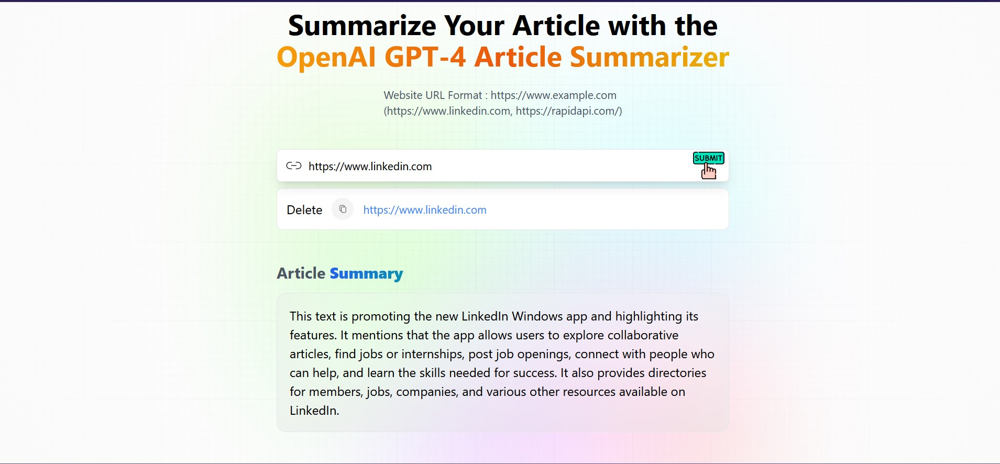
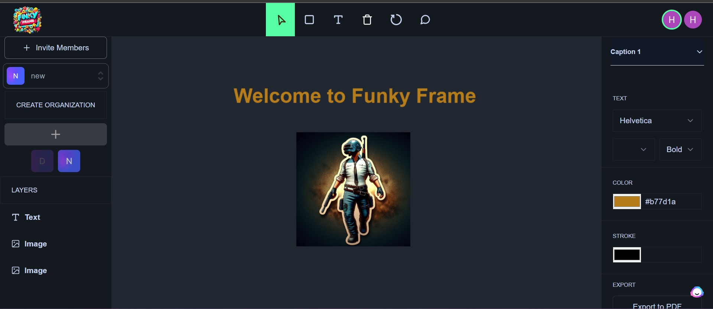

# Habib Tanwir's Portfolio

## About Me

I'm Habib Tanwir, a Full Stack Web Developer passionate about creating engaging and functional web applications. With experience in modern web technologies and a keen eye for design, I strive to build innovative solutions that make a difference.

## Projects

### 1. Promptwar

An AI-powered art showcase platform that encourages creativity and community engagement.

- **Key Features:**
  - Upload and display AI-generated artwork
  - Weekly thematic challenges
  - Community leaderboard for top creators

**Technologies:** Next.js, Appwrite, Tailwind CSS

[GitHub](https://github.com/Habib7442/prompt-war) | [Live Demo](https://promptwar.vercel.app/)

### 2. Quizllo

An AI-powered quiz platform for personalized and dynamic learning experiences.

- **Key Features:**
  - AI-generated quizzes from PDF documents
  - Topic-based and job description-based quiz generation
  - One-vs-many competitive mode
  - Specialized JavaScript quiz for coding skills

**Technologies:** Next.js, Firebase, Tailwind CSS, Aceternity UI, Shadcn

[GitHub](https://github.com/Habib7442/quizllo) | [Live Demo](https://quizllo.vercel.app/)

### 3. Article Summarizer and Extractor

A tool to quickly generate concise summaries of lengthy articles and extract relevant content.

- **Key Features:**
  - Article summarization
  - Content extraction
  - User-friendly interface
  - Responsive design

**Technologies:** React JS, Redux, Tailwind CSS

[GitHub](https://github.com/Habib7442/article-summarizer-extractor) | [Live Demo](https://articlesummarease.netlify.app/)

### 4. FunkyFrame

A cutting-edge web application for collaborative design with real-time features.

- **Key Features:**
  - Live collaboration using Liveblocks
  - Secure authentication with Clerk
  - AI-generated image captions using Google Gemini
  - Real-time reactions and comments

**Technologies:** Next.js, Liveblocks, Tailwind CSS, Google Gemini, Shadcn

[GitHub](https://github.com/Habib7442/funky-frame) | [Live Demo](https://funky-frame.vercel.app/)

## Skills

| | | | | |
|:---:|:---:|:---:|:---:|:---:|
|    HTML5 |    CSS3 |    JavaScript |    React |    Next.js |
|    Tailwind CSS |    Firebase |    MongoDB |    Node.js |    Git |
## Experience

### Full Stack Web Developer (Intern) | CDAC Silchar
*August 2022 - October 2022*

- Designed a visually appealing course website with a modern layout
- Collaborated with cross-functional teams to create high-quality products
- Implemented responsive design and ensured cross-browser compatibility
- Used dynamic visuals and animations to enhance user experience

### React JS Developer (Intern) | Unschool
*August 2022 - September 2022*

- Developed and maintained web applications using React.js
- Created a Full Stack Portfolio website
- Implemented responsive design and cross-browser compatibility
- Participated in code reviews and provided constructive feedback

## Connect With Me

|  |  |  |  |
|:---:|:---:|:---:|:---:|
| LinkedIn | GitHub | X | Resume |

Feel free to reach out for collaborations or just a chat about web development!